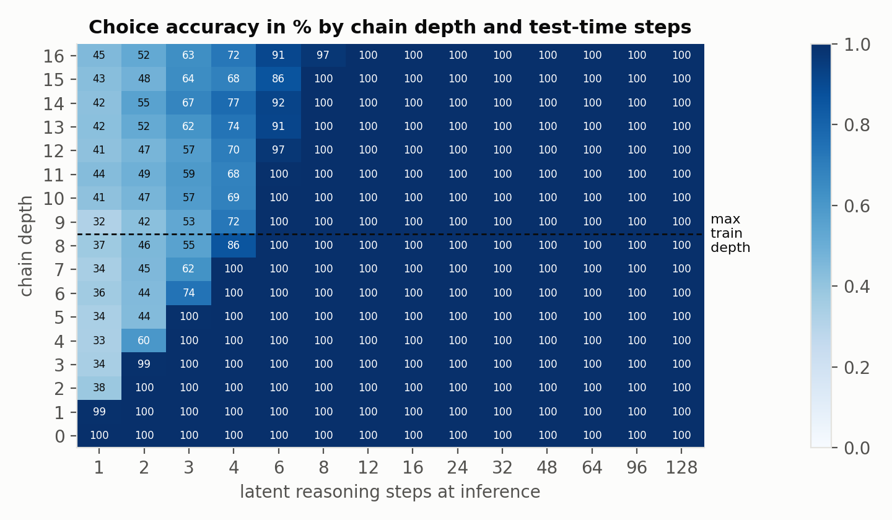

# z-reason

Code for the preprint **Latent Reasoning Steps for Typed Decisions: Test-Time Compute for System-One Models**, by Silvan Ferreira, Thiago Medeiros and Ivanovitch Silva, Institute of Digital Metropolis, Federal University of Rio Grande do Norte. The PDF is in [`paper/main.pdf`](paper/main.pdf).

System-One models such as Jev answer typed questions about a state with calibrated probabilities over a predefined set of answers instead of generating text. They are fast and cannot return an answer outside the schema, but they spend the same computation on every question. z-reason keeps the same request and response interface and adds a `steps` parameter. Between encoding and read-out, a weight-tied block refines a latent state `z` for the requested number of steps, much as a diffusion sampler runs a chosen number of denoising steps, and more steps let the model answer harder questions.



## Main results

All results come from a synthetic variable tracking task in which the difficulty is the length of a dependency chain. Models are trained on chains of at most 8 hops and evaluated on chains of up to 32 hops. The table reports accuracy on `choice` questions in percent, averaged over three seeds for z-reason.

| model | parameters | test-time steps | depth 1 to 8 | depth 9 to 12 | depth 13 to 16 |
|---|---|---|---|---|---|
| z-reason, random step training | 4.1M | 2 | 67.3 | 46.1 | 51.8 |
| z-reason, random step training | 4.1M | 8 | 100.0 | 100.0 | 99.3 |
| same model, trained with 8 fixed steps | 4.1M | 8 | 100.0 | 58.1 | 14.2 |
| transformer without weight tying | 15.1M | fixed | 100.0 | 38.2 | 36.1 |

More steps solve deeper chains, and the model extrapolates reliably to twice its training depth. At three to four times the training depth the extrapolation is partial and depends on the seed. The number of steps needed grows sublinearly with depth, calibration error falls as steps increase, and with `steps="auto"` the model spends more steps on harder questions. The paper discusses each result together with its limitations, the most important being that everything was measured on a single synthetic task.

## Installation

```bash
git clone git@github.com:silvaan/z-reason.git
cd z-reason
pip install -r requirements.txt
python -m pytest -q tests
```

The experiments were run with Python 3.10, PyTorch 2.5 and CUDA on a single RTX 3060 with 12 GB of memory.

## Usage

A request follows the schema of Jev's API. Each question has a type, instructions and, for `choice` and `score`, a list of answer options. The model only assigns probabilities to the options it receives, so the answer always matches the schema.

```python
from zreason.api import ZReason

model = ZReason.load("runs/zr_s0")
model.predict(
    state="q=4;m=q;Z=m;c=7;k=c;w=2;T=w;A=T;B=A;C=B;D=C;E=D",
    questions={
        "value": {"type": "choice", "instructions": "val E", "criteria": {str(i): str(i) for i in range(10)}},
        "bucket": {"type": "score", "instructions": "lvl Z", "criteria": ["0-1", "2-3", "4-5", "6-7", "8-9"]},
        "depends": {"type": "noul", "instructions": "dep E w"},
    },
    steps=8,  # an integer, or "auto" to stop once the answers stop changing
)
```

The response has the same shape as Jev's, with a `choice` and its `probabilities` and `confidence`, a `score` with its `legend`, and a `noul` probability, plus the number of steps used. Running `python -m examples.demo` answers the same questions with 1, 2, 4 and `"auto"` steps, which shows the answer to `val E` changing from wrong to right as steps are added.

Checkpoints are not stored in the repository. Train one with `python train.py --out runs/zr_s0 --seed 0 --iters 12000 --bs 128`, which takes about 48 minutes on the GPU above.

## Reproducing the paper

```bash
./run_experiments.sh
```

The script trains the three seeds of the main model and the two baselines, evaluates all of them on depths 1 to 16 and 16 to 32, runs the attention and trace analyses, and regenerates every figure and table used by the paper. It takes about 4.5 hours on one RTX 3060. The evaluation outputs of our runs are already in `runs/`, so `python plots.py` and `python paper/make_tables.py` can rebuild the figures and tables without training. To build the PDF, run `latexmk -pdf main.tex` inside `paper/`.

## Repository layout

The model code lives in `zreason/`. The task generator is `tasks.py`, the conversion of Jev-style requests into tensors is `batching.py`, the model and its losses are in `model.py`, and `api.py` exposes `ZReason.predict`. Training, evaluation and plotting are handled by `train.py`, `eval.py` and `plots.py` at the top level, with markdown summaries from `summary.py`. The attention and trace analyses are in `analysis/`, the unit tests in `tests/` and a usage example in `examples/`. The directory `runs/` keeps the configuration, training log and evaluation results of every run reported in the paper, and `paper/` holds the LaTeX source, the generated tables and the figures.

## Citation

```bibtex
@misc{ferreira2026latent,
  title  = {Latent Reasoning Steps for Typed Decisions: Test-Time Compute for System-One Models},
  author = {Ferreira, Silvan and Medeiros, Thiago and Silva, Ivanovitch},
  year   = {2026},
  note   = {Preprint}
}
```

## License

MIT, see [LICENSE](LICENSE).
